# Flujo del Proyecto: Resumen de lo que se probo

## 1. EDA (Análisis Exploratorio de Datos):Fase inicial orientada a conocer el dataset en profundidad antes de entrenar.

- Recolección y limpieza: se recorrieron recursivamente las carpetas del dataset, se detectaron y removieron duplicados mediante hash MD5.
- Split estratificado 60/20/20: separación en Train, Val y Test manteniendo la proporción de clases en cada subconjunto, garantizando cero data leakage.
- Distribución de clases: se analizó la cantidad de imágenes por clase en cada split. Se identificó que Tinea Ringworm Candidiasis es la clase menos representada.
- Distribución de resoluciones: se relevaron las resoluciones presentes en el dataset. La más frecuente es (600, 450), con gran variedad general: necesidad de redimensionar a tamaño fijo.
- Sanity check RGB: verificación de que todas las imágenes del dataset están en formato RGB.
- Ejemplos visuales por clase: visualización de 5 imágenes por clase en Train y Val.
- Varianza intra-clase: medición de qué tan heterogéneas son las imágenes dentro de cada clase. Melanoma y Atopic Dermatitis resultaron las más variables; Actinic Keratosis y Dermatofibroma las más homogéneas.
- Detección de outliers por clase: identificación de las imágenes más atípicas dentro de cada clase en Train usando z-score sobre distancia al vector medio.

## 2. Prueba Manual Inicial: Primer contacto con el modelado para amigarme con la arquitectura y las herramientas, siguiendo las reglas generales de entrenamiento:

Las técnicas se fueron aplicando en este orden:

- Data Augmentation (Flips, CLAHE, RandomBrightnessContrast, HueSaturationValue)
- Ajuste de arquitectura (tamaño de red/ + capas ocultas)
- Early Stopping 
- Regularización via weight decay 
- Dropout 
- Batch Normalization 
- Inicialización de pesos Kaiming Normal

* Recomendación: no cambiar varios hiperparámetros al mismo tiempo.

**Mejor configuración encontrada de forma manual:** BatchNorm + Dropout (0.2/0.2) + Weight Decay (1e-4), Adam lr=0.001, batch=32, input 64×64, early stopping patience=5, augmentations de HFlip, VFlip, RandomBrightnessContrast, CLAHE, HueSaturationValue y CoarseDropout. Resultados: train acc 61.3% / train loss 1.054 — val acc 60.4% / val loss 1.114, con una brecha de menos de 1 punto.

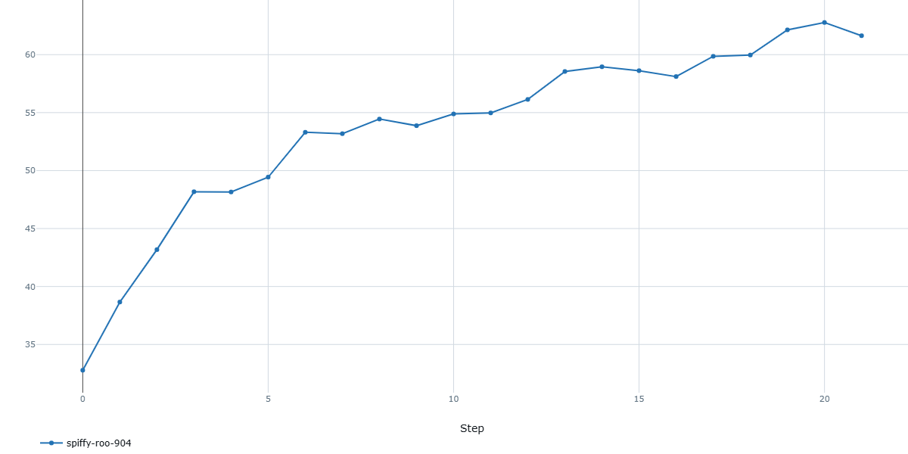
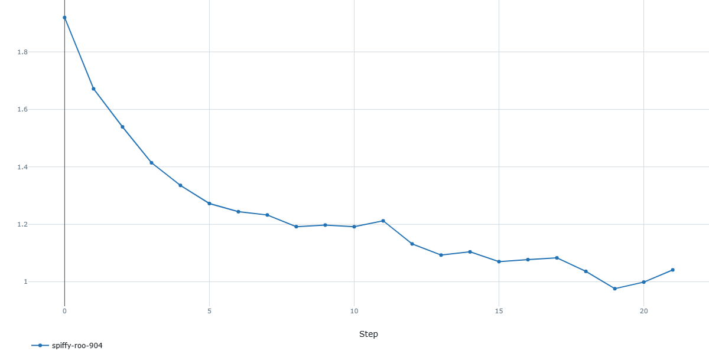
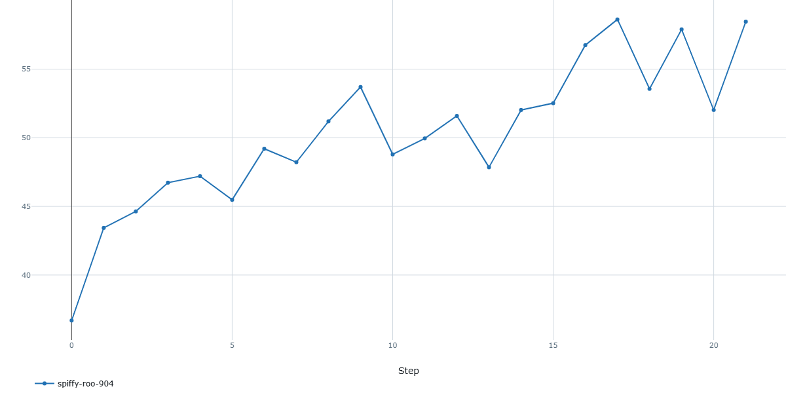
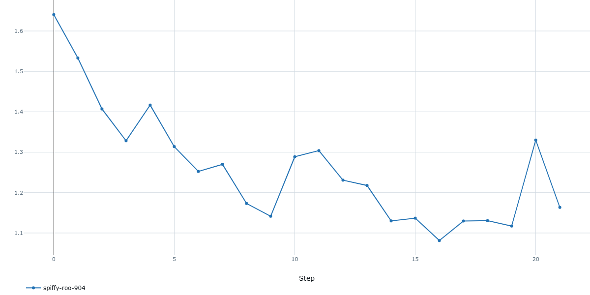

## 3. Búsqueda Automática de Hiperparámetros: Automatización del proceso mediante Random Search, explorando el espacio de soluciones.

Espacio de búsqueda: se definieron los siguientes hiperparámetros a explorar:

Tamaño de entrada de la imagen: 32×32 o 64×64
Batch size: 16 o 64
Learning rate: 1e-3 o 1e-4
Optimizador: Adam o SGD (con momentum 0.9 o 0.99)
Probabilidades de augmentations: Horizontal/Vertical Flip, RandomBrightnessContrast, CLAHE, CoarseDropout
Dropout: 0.0, 0.1, 0.2 o 0.3
Inicialización de pesos: Default o Kaiming

Se sorteó el 5% del espacio total de 3.072 combinaciones, resultando en 207 modelos. 

Conclusiones de la búsqueda:
- SGD con momentum 0.99 va mejor.
- Batch size 16 fue consistentemente mejor que 64.
- Input 32×32 funcionó igual o mejor que 64×64, con menos parámetros.
- CoarseDropout no aportó en ninguno de los top modelos (p=0.0 en todos). 

**Mejor modelo**: Corrida c30e84ff con val acc 63.9% (mayor a train acc), el modelo generaliza mejor de lo que memoriza. 
SGD lr=1e-3, batch=16, input=32×32, dropout=0.1, momentum=0.99, HFlip=0.5, VFlip=0.5, RBContrast=0.5

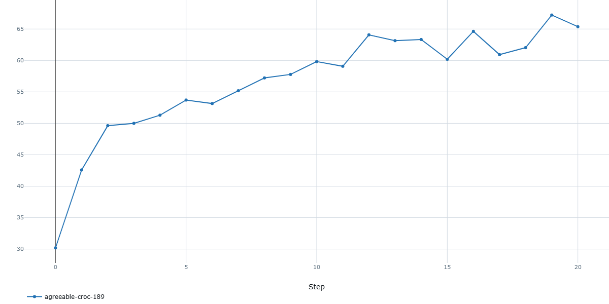
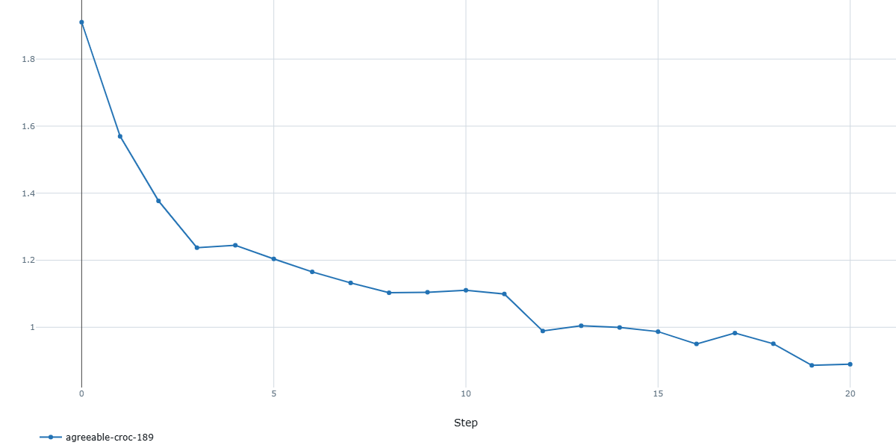
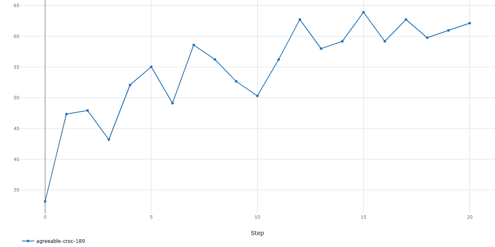
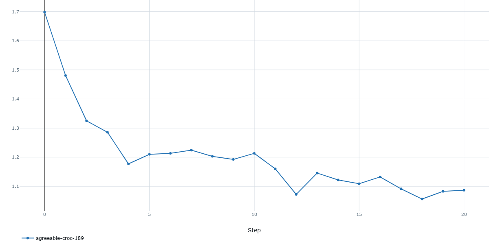

## 4. Refinamiento Manual de Candidatos Ganadores
A partir de los resultados de la búsqueda, se identificaron los mejores modelos filtrando por val accuracy ≥ 60% y brecha train/val ≤ 10 puntos. 

Al intentar replicar los HP del mejor modelo de la búsqueda (SGD lr=1e-3, batch=16, dropout=0.1, momentum=0.99, HFlip/VFlip/RBContrast=0.5), los resultados variaban entre corridas porque la inicialización de pesos es aleatoria y no se había guardado la semilla original. Probe distintas semillas (42, 7, 0, 123) hasta encontrar una que diera resultados similares. 

Finalmente el modelo ganador (con el que hice el test): 

| Conjunto de Datos | Accuracy (mejor checkpoint) |
| :--- | :---: | :---: |
| **Entrenamiento (Train)** | 64.44% |
| **Validación (Val)** | 65.58% | 

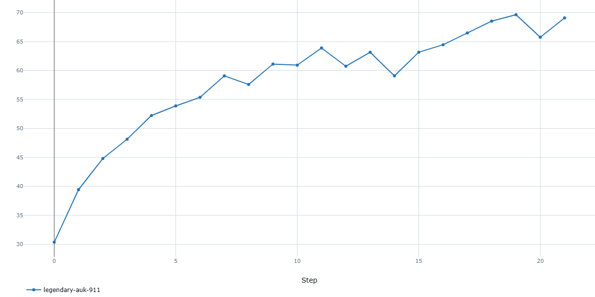
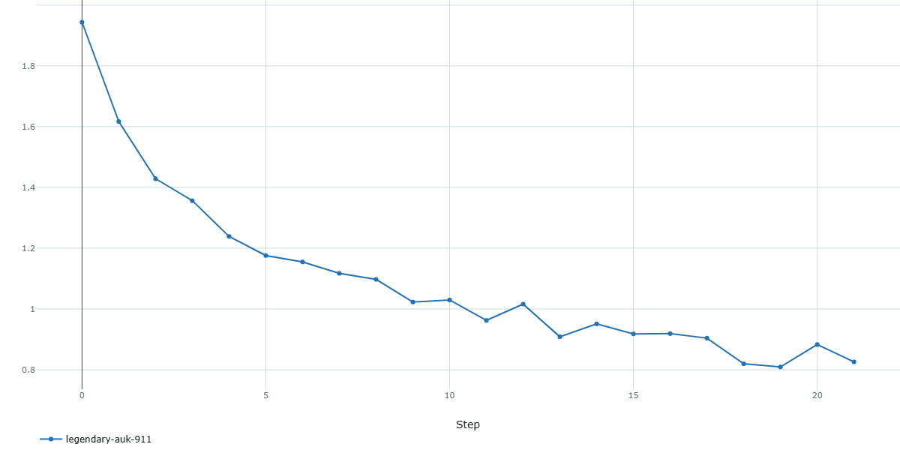
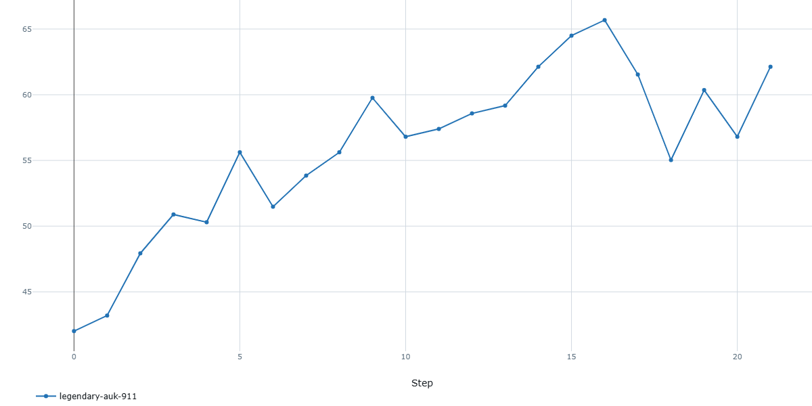
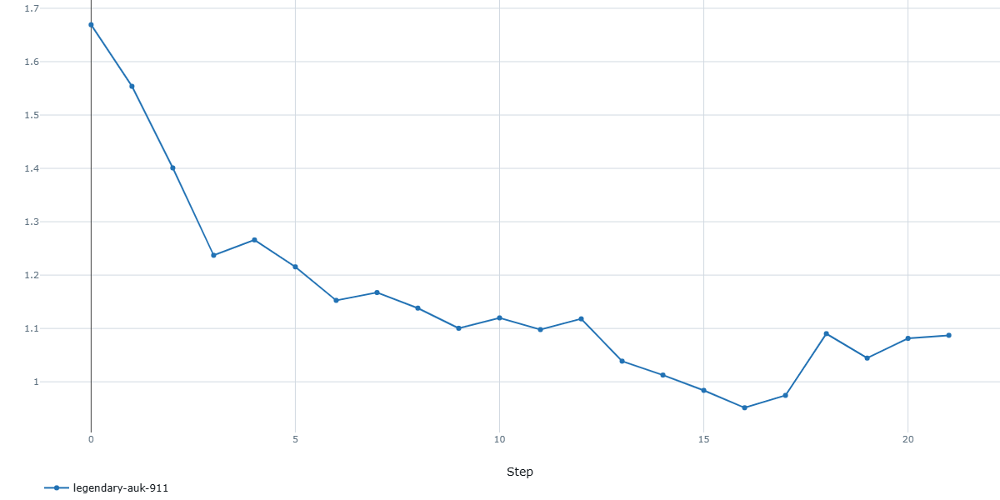

.

## 5. Test (Evaluación Final)
Se procedió con la evaluación definitiva del modelo campeón (`legendario-auk-911`) utilizando el **Test Set**.

#### Métricas Globales Obtenidas

| Métrica | Resultado Final |
| :--- | :---: |
| **Accuracy (Precisión)** | **60.95%** |
| **Pérdida (Loss)** | **1.0118** |

Considerando que el piso probabilístico para un acierto aleatorio en un problema de **9 clases** es un **11.11%**, alcanzar un Accuracy final del **60.95%** esta bastante bien.

#### Análisis de la Matriz de Confusión de TEST

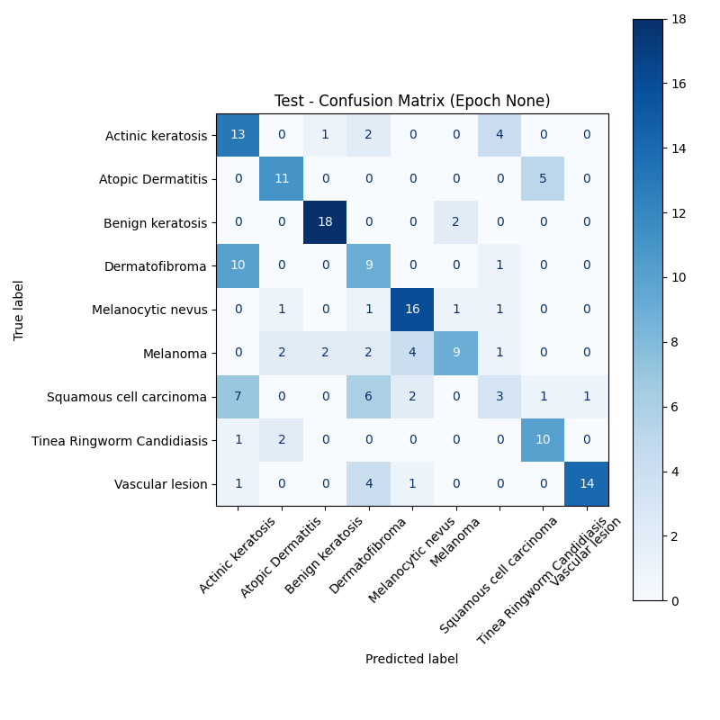

Al desglosar la matriz de confusión del conjunto de prueba, se extrajeron observaciones críticas sobre la lógica de aprendizaje de la red:

- El modelo funcionó muy bien con clases como Benign keratosis (18/20 aciertos), Melanocytic nevus (16/20) y Vascular lesion (14/15). En estos casos, la red encontró características visuales claras y no tuvo problemas para identificarlas.

- Confusiones por aspecto visual: Las fallas principales se dieron entre manchas que se ven muy parecidas. Por ejemplo, confundió seguido Dermatofibroma con Actinic keratosis, algo lógico porque a nivel de píxeles comparten texturas y colores similares.

- Lógica médica: También se dio una confusión repetida entre el Squamous cell carcinoma y la Actinic keratosis. Esto tiene sentido clínicamente, ya que la queratosis es la lesión precursora (la etapa previa) de ese cáncer. Al ser fases de la misma enfermedad, es esperable que a la red le cueste diferenciarlas.

